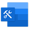

# AutoPortal



## 简介

AutoPortal 是一个基于 WinUI 3 的校园网 Portal 自动登录工具，支持记住密码、自动登录等功能。

> **适用学校**：广州市信息技术职业学校校园网

## 功能特性

- ✅ **自动登录** - 连接校园网时自动检测并登录
- ✅ **记住密码** - 安全保存账号密码
- ✅ **状态检测** - 实时检测网络和登录状态
- ✅ **主题切换** - 支持深色/浅色主题
- ✅ **Mica 背景** - 现代化毛玻璃效果
- ✅ **简洁界面** - 现代化 UI 设计，操作简单

## 系统要求

- **操作系统**: Windows 10 1809 或更高版本
- **架构**: x64
- **内存**: 至少 2GB RAM
- **磁盘空间**: 至少 100MB 可用空间

## 安装说明

### 下载安装包

从 [GitHub Releases](https://github.com/worable/AutoPortal/releases) 下载最新版本的安装程序。

### 安装步骤

1. 双击运行 `AutoPortal_vX.X.X_Setup.exe`
2. 阅读并同意许可协议
3. 选择安装位置（默认：`C:\Program Files\AutoPortal`）
4. 选择附加任务（创建桌面快捷方式等）
5. 点击"安装"开始安装
6. 安装完成后点击"完成"启动应用

## 使用说明

### 首次使用

1. 启动 AutoPortal
2. 进入欢迎页面，点击"开始配置"
3. 输入学号和密码
4. 点击"保存配置"

### 配置账号

- 点击左侧菜单 **"设置"**
- 在 **"账号配置"** 区域修改：
  - 学号
  - 密码
  - Portal 地址
- 点击 **"保存配置"**

### 登录

- **自动登录**：连接校园网后自动检测并登录
- **手动登录**：点击 **"立即登录"** 按钮

### 设置开机自启

1. 进入 **"设置"** 页面
2. 启用 **"开机自动启动"** 选项

## 构建和发布

### 环境要求

- .NET 8.0 SDK
- Visual Studio 2022（可选）
- Windows 10 SDK

### 构建项目

```bash
dotnet build
```

### 运行项目

```bash
dotnet run
```

### 发布应用

```bash
dotnet publish -c Release -r win-x64
```

发布输出目录：`bin/Release/net8.0-windows10.0.19041.0/win-x64/publish/`

### 创建安装包

需要安装 [Inno Setup 7](https://jrsoftware.org/isdl.php)

```bash
"C:\Program Files\Inno Setup 7\ISCC.exe" AutoPortal.iss
```

安装包输出位置：`.AutoPortal_Setup_X.X.X.exe/AutoPortal_vX.X.X_Setup.exe`

## 项目结构

```
AutoPortal/
├── App.xaml                  # 应用程序入口
├── MainWindow.xaml           # 主窗口
├── Pages/                    # 页面
│   ├── HomePage.xaml        # 主页
│   ├── LoginPage.xaml       # 登录页
│   ├── SettingsPage.xaml    # 设置页
│   ├── WelcomePage.xaml     # 欢迎页
│   └── NavigationPage.xaml  # 导航页
├── Services/                 # 服务层
│   ├── NavigationService.cs # 导航服务
│   ├── LoggerService.cs     # 日志服务
│   └── AppSettingsService.cs# 设置服务
├── Helpers/                  # 辅助类
│   ├── LoginValidator.cs    # 登录验证
│   └── NativeDllExtractor.cs# DLL 提取
├── Login/                    # C++ DLL 项目
│   ├── Login.cpp            # 登录实现
│   └── Login.h              # 头文件
├── Assets/                   # 资源文件
└── AutoPortal.iss           # Inno Setup 脚本
```

## 故障排除

### 无法登录

1. ✅ 检查网络连接是否正常
2. ✅ 确认学号和密码正确
3. ✅ 检查 Portal 地址是否正确

### 应用无法启动

1. ✅ 查看日志文件：`%LOCALAPPDATA%\AutoPortal\startup.log`
2. ✅ 确保所有 DLL 文件存在
3. ✅ 以管理员身份运行

### XAML 解析错误

1. ✅ 确保 `AutoPortal.pri` 文件存在
2. ✅ 确保 `Assets` 文件夹和图标文件存在
3. ✅ 重新安装应用

### DLL 加载失败

确保以下文件在应用目录：
- `Login.dll`
- `libcurl.dll`
- `zlib1.dll`

## 技术栈

- **框架**: WinUI 3 (Windows App SDK 1.8.2)
- **运行时**: .NET 8.0
- **语言**: C# 10 & C++ 17
- **图表**: LiveChartsCore
- **安装工具**: Inno Setup 7

## 许可证

[Attribution-NonCommercial-ShareAlike 4.0 International (CC BY-NC-SA 4.0)](LICENSE)

## 开发者

- **Publisher**: worable
- **GitHub**: [@worable](https://github.com/worable)

## 更新日志

### v1.1.0
- ✨ 优化安装程序，添加中文语言支持
- 🎨 更新应用图标
- 🐛 修复窗口显示问题
- 📝 完善文档

### v1.0.0
- 🎉 首次发布
- ✅ 实现基本登录功能
- ✅ 支持记住密码
- ✅ 支持自动登录
