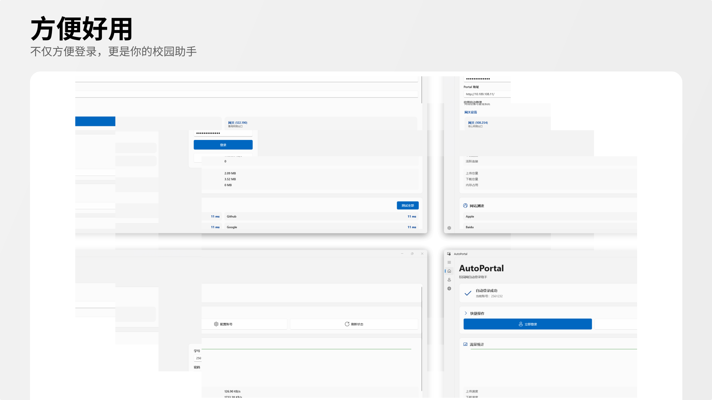
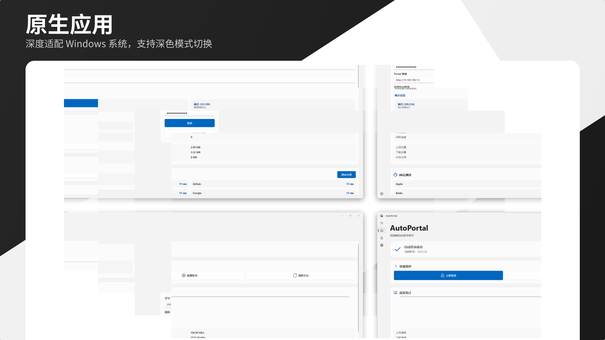

# AutoPortal


## 简介

AutoPortal 是一个基于 WinUI 3 的校园网 Portal 自动登录工具，支持开机自启动、自动登录等功能。

> **适用学校**：广州市信息技术职业学校校园网

## 功能特性

- ✅ 自动登录、记住密码
- ✅ 小体积、极致优化
- ✅ Mica效果、流畅丝滑
- ✅ 自定义布局、原生开发

详细功能请查看 [功能特性文档](docs/FEATURES.md)

## 应用截图


不仅方便登录，更是你的校园助手


深度适配 Windows 系统，支持深色模式切换

## 快速开始

### 安装

从 [GitHub Releases](https://github.com/worable/AutoPortal/releases) 下载最新安装包。

详细安装说明请查看 [安装指南](docs/INSTALL.md)

### 使用

1. 启动应用，配置学号和密码
2. 连接校园网后自动登录
3. 可在设置中按照喜好调节

详细使用说明请查看 [使用指南](docs/USAGE.md)

## 构建

```bash
# 构建
dotnet build

# 运行
dotnet run

# 发布
dotnet publish -c Release -r win-x64
```

详细构建说明请查看 [构建指南](docs/BUILD.md)

## 技术栈

- **框架**: WinUI 3 (Windows App SDK 1.8.2)
- **运行时**: .NET 8.0
- **语言**: C# 10 & C++ 17
- **图表**: LiveChartsCore

## 许可证

[Attribution-NonCommercial-ShareAlike 4.0 International (CC BY-NC-SA 4.0)](LICENSE)

---

**文档索引**：
- [功能特性](docs/FEATURES.md)
